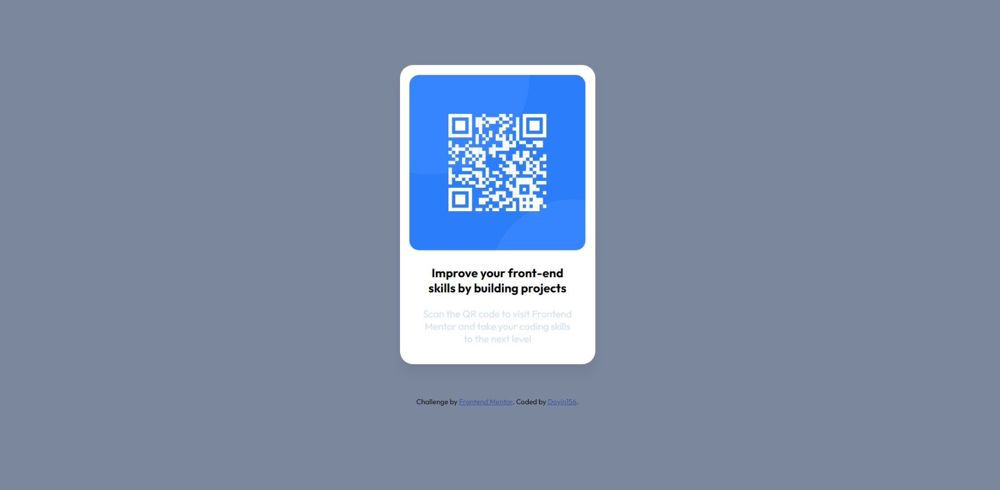

# Frontend Mentor - QR code component solution

This is a solution to the [QR code component challenge on Frontend Mentor](https://www.frontendmentor.io/challenges/qr-code-component-iux_sIO_H). Frontend Mentor challenges help you improve your coding skills by building realistic projects. 

## Table of contents

- [Overview]
  - [Screenshot](#screenshot)
  - [Links](#links)
- [Author]
- [Acknowledgments]


## Overview
Qr code component using basic HTML and CSS

### Screenshot




### Links

- Solution URL: [Add solution URL here](https://github.com/doyin156/qr_code_component.git)
- Live Site URL: [Add live site URL here](https://your-live-site-url.com)

## My process
Started with the basic HTML layout and then proceeded to styling with CSS
### Built with

- Semantic HTML5 markup
- CSS custom properties

### What I learned

I learned how to write just a line of code for margins.

```css
.proud-of-this-css {
  margin: 100px auto auto auto;
}
```

## Author

- Frontend Mentor - [@D0yin156](https://www.frontendmentor.io/profile/Doyin156)
